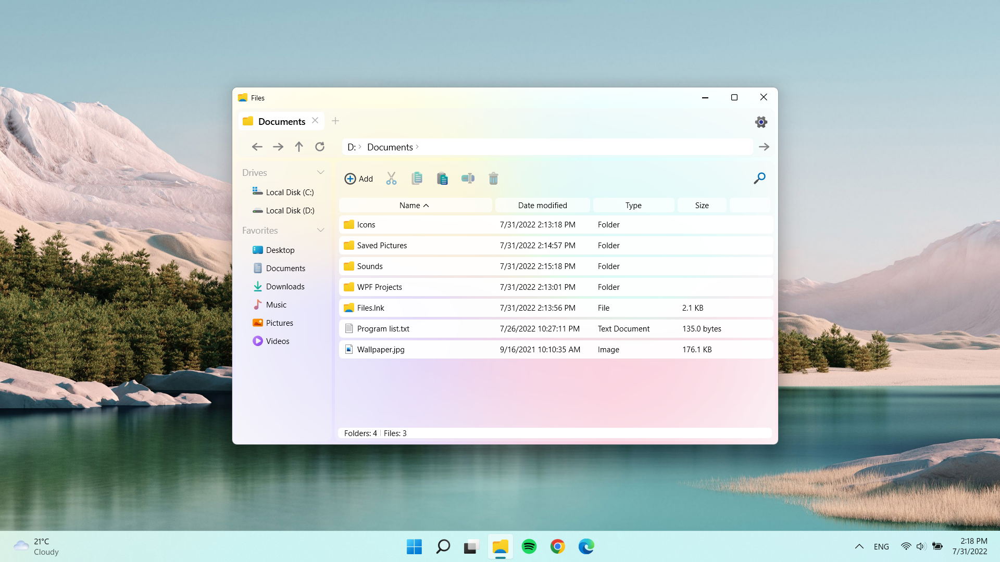
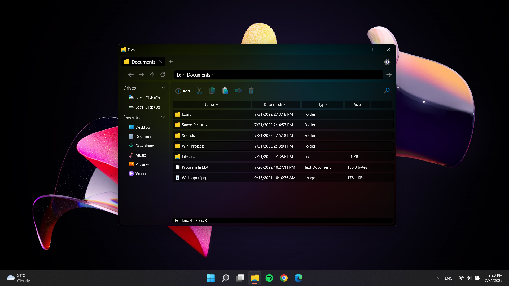

  
  <h1 align="center">Files Windows</h1>

## ⭐What is Files Windows?
It is a file manager for Windows that can manage and view files. 
The program supports tabs, pinning a window on top of other windows, and dragging files with the mouse

## 💡Possibility
View files or directory contents. Manage files: create, cut, copy, paste, move, rename, delete. 
There is clipboard support and compatibility with other file explorers. 
It is also possible to change the design theme to [light](https://github.com/pavlogook/Files-Windows/edit/main/README.md#light-theme) or [dark](https://github.com/pavlogook/Files-Windows/edit/main/README.md#dark-theme) and choose the interface language (English, Ukrainian)

## ⚙️Technologies
The program is built using the MVVM design pattern. Also used technologies such as WPF, Win32 API, XAML

## 🚀How to start the program
1. Clone the project from GitHub
2. If necessary, install [Windows Desktop Runtime 6.0.x](https://dotnet.microsoft.com/en-us/download/dotnet/6.0)
3. Open [`Files.sln`](https://github.com/pavlogook/Files-Windows/blob/main/Files.sln) file in Visual Studio 2019 or newer version
4. Run and enjoy the program 😉

## ✨Screenshots
### Light theme

### Dark theme

